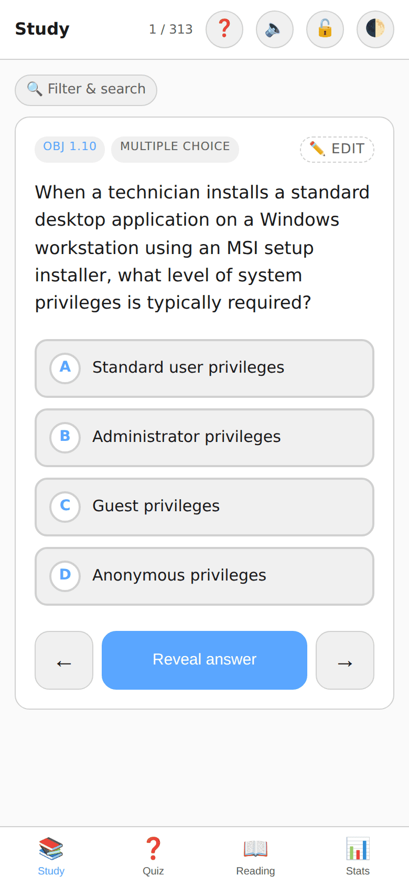
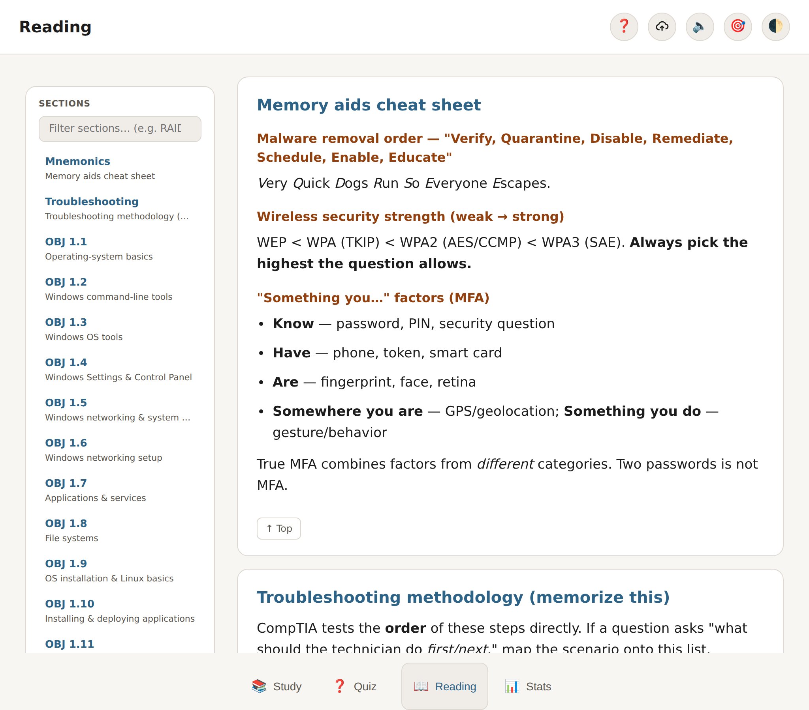
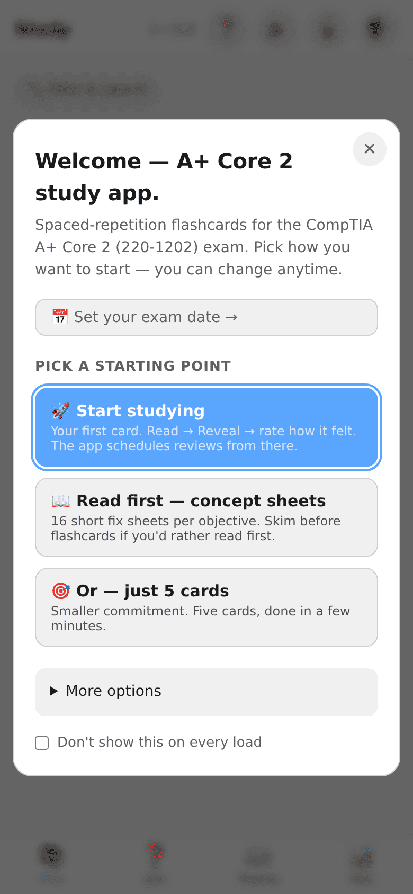
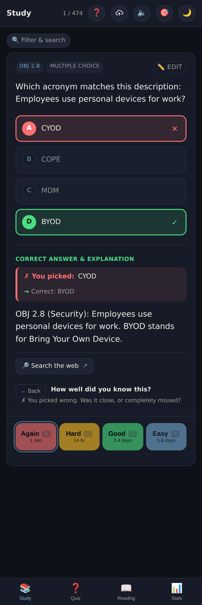
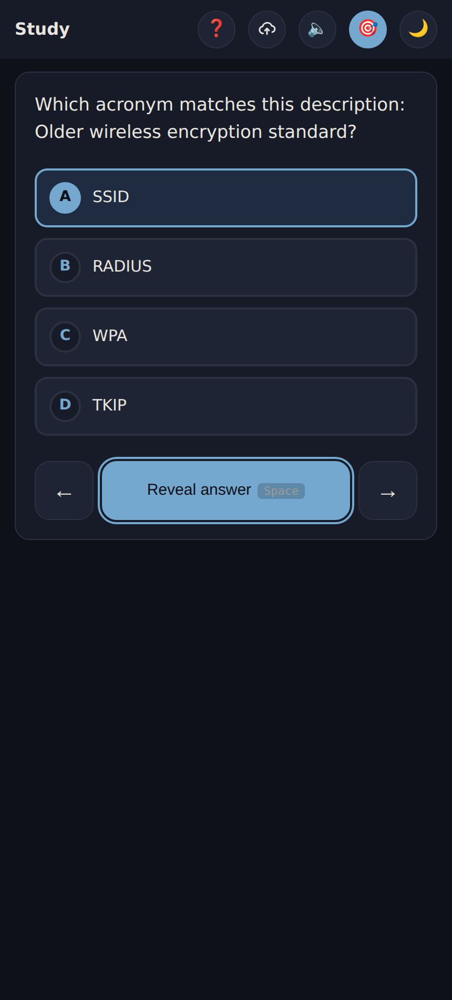

# A+ Study — iPad + iPhone Study App

A Progressive Web App (PWA) for studying the CompTIA A+ Core 2 (220-1202) exam.
Built for my own studying — neurodivergent-first, offline-capable,
Apple-Pencil-aware — and open for anyone to fork. Installs to home screen on
**iPad** (full Pencil support) **or iPhone** (thumb-friendly layout, swipe to
advance).

> ⚠️ **Unofficial, independent project — not affiliated with, authorized, or
> endorsed by CompTIA.** All questions are original, written from the publicly
> published exam objectives; no real exam content is reproduced. See [Legal and
> disclaimer](#legal-and-disclaimer). “CompTIA” and “A+” are trademarks of
> CompTIA.


**🔗 Live demo:** [aplusstudyapp.pages.dev](https://aplusstudyapp.pages.dev) —
installable; works fully offline once loaded.

## Why this exists / what's interesting

A spaced-repetition study app is a common project. The parts I think are worth a
look:

- **Zero dependencies, no build step.** ~4,000 lines of vanilla ES-module
  JavaScript — `app.js` (UI + state), `lib.mjs` (pure, tested SRS/formatting
  helpers), `crypto.mjs` (encryption). No framework, no bundler, no
  `node_modules` at runtime. Clone and open `index.html`.
- **Offline-first PWA.** A service worker precaches the shell + question bank,
  so after the first load it runs in airplane mode and installs to the
  iOS/iPadOS home screen like a native app.
- **Real client-side encryption.** Optional PIN lock derives an AES-GCM-256 key
  via PBKDF2 (SHA-256, 310,000 iterations, random salt) and re-encrypts
  everything in IndexedDB at rest. The PIN and derived key are never stored —
  only a salt and a verification blob (`crypto.mjs`).
- **A genuine touch-safety problem, solved.** iPad "ghost taps" after revealing
  an answer would skip cards. The fix is a deliberate 5-layer stack (CSS
  `pointer-events` lockout, JS timestamp guards, swipe-target checks, scoped
  sticky positioning, ID-based history) — documented in `AGENTS.md` so it
  doesn't regress.
- **Accessibility as a design driver, not a checkbox.** Focus traps, skip links,
  `prefers-reduced-motion` support, dyslexia-friendly fonts (Atkinson
  Hyperlegible, OpenDyslexic), high-contrast mode, full text-scaling, and an
  "anxiety mode" that hides judgemental metrics. See the [AuDHD-friendly
  features](#audhd-friendly-features) section.
- **Tested + CI-gated.** 75 unit/data tests via Node's built-in test runner,
  plus a content validator (`scripts/validate-questions.mjs`) that catches
  unwinnable questions, mismatched objectives, and broken image refs. Both run
  in GitHub Actions on every push.

## Tech stack

| Layer | Choice |
|---|---|
| **Language** | Vanilla JavaScript (ES modules), HTML, CSS — no framework |
| **Storage** | IndexedDB (progress, per-question overrides, scratchpad drawings, reference PDFs) + `localStorage` for prefs |
| **Offline** | Service Worker (cache-first precache) + Web App Manifest |
| **Crypto** | Web Crypto API — PBKDF2 → AES-GCM-256 |
| **Optional sync** | Supabase (anon key + user-chosen sync key) |
| **Tests** | `node --test` (75 tests) + a custom JSON content validator |
| **CI / hosting** | GitHub Actions → Cloudflare Pages |

## Screenshots

<p>
  
  
  
</p>

**Calm / low-stimulation modes** — for the overstimulated (autism-side) days: a
dark theme, and **Focus Mode**, which strips away the tab bar, filter chips,
progress counters, and card meta to leave just the question and answers.

<p>
  
  
</p>

## What's in it

- **Study mode** — flashcards with spaced repetition (again / hard / good /
  easy). Cards come back at increasing intervals based on how well you did;
  "again" brings it back in a minute, "easy" pushes it out days.
- **Quiz mode** — same questions but tracked as right/wrong for accuracy stats.
  Wrong answers are scheduled for quick review; right answers graduate out.
- **Reading mode** — 37 concept-fix sheets, one per Core 2 sub-objective, plus a
  malware-removal mnemonics sheet and the 6-step troubleshooting methodology.
  Tables, code, and "For the exam" tips for each topic; navigable from a sticky
  TOC sidebar.
- **Stats mode** — mastery bars per OBJ, accuracy, shuffle toggle, export/import
  progress, reset.
- **Readable explanations** — long CompTIA explanations are auto-split into a
  lead answer + supporting paragraphs, with any "For the exam..." tip pulled
  into its own callout. No more walls of text.
- **Apple Pencil scratch pad** — beneath every question on iPad (shown at widths >600px),
  pressure-sensitive canvas for subnet math, diagrams, etc. Hidden on iPhone
  portrait to keep the card readable.
- **Filter by OBJ, "Due", or search** — scroll the filter bar to drill a
  specific objective, toggle the green **Due (N)** chip to see only cards
  scheduled for review, or type in the search box to narrow by
  question/explanation text.
- **Shuffle** — optional random order, toggled from Stats. Persists across
  sessions.
- **Swipe / keyboard / prev** — swipe left on Study/Quiz cards to skip; use the
  **← Prev** button to go back; desktop keyboard shortcuts (see below).
- **Theme toggle** — 🌓 button in the header cycles Auto / Light / Dark, saved
  to your device.
- **Export / import progress** — download your progress as JSON from Stats,
  import it on another device or after a browser wipe.
- **Offline** — service worker caches everything. Once installed, works in
  airplane mode.
- **Progress persists** — IndexedDB stores ratings, ease, and next-due
  timestamps between sessions.

## Keyboard shortcuts (desktop study)

| Key | Action |
|---|---|
| `Space` / `Enter` / `R` | Reveal answer. If already revealed: Study mode advances with a "good" rating; Quiz mode just skips (explicit right/wrong tap is required to record a quiz result). |
| `1` / `2` / `3` / `4` | Rate: Again / Hard / Good / Easy (Study mode, after reveal) |
| `→` / `K` / `N` | Next question |
| `←` / `J` / `P` | Previous question |
| `T` | Cycle theme (auto / light / dark) |
| `F` | Toggle Focus Mode (hides chrome) — `Esc` also exits |

## AuDHD-friendly features

Built to be flexible, because sensory needs flip between *understimulated*
(ADHD-side: needs visual engagement) and *overstimulated* (autism-side: needs
calm, minimal UI). Everything here is togglable from **Stats → Accessibility**,
**Stats → Focus session**, and the 🔒 / 🌓 header buttons.

- **Focus Mode** (🔒 button or `F`) — hides the tab bar, filter chips, search
  box, progress HUD, and card meta tags. Just the question. Great when scrolling
  chrome becomes noise.
- **Focus Sessions** (Stats → Focus session):
  - **Time-boxed** — 5 / 15 / 25 min with a visible ⏱ countdown in the header
    (time-blindness).
  - **Card-count micro-goals** — 1 / 3 / 5 / 10 cards. Session ends
    automatically when the count is hit. "One card" is a valid commitment; you
    can always do one.
  - End-of-session summary celebrates whatever you did. "End now" exits early
    without guilt.
- **Anxiety Mode** — hides accuracy %, progress counters, mastery bars, seen
  counts. Keeps streak + session timer. Turn on when numbers feel like
  judgement.
- **Focus sound** — built-in white / pink / brown noise generator via Web Audio
  (no downloads, no tracking). Pink is gentler than white; brown is "the one
  that sounds like a waterfall."
- **Shake to shuffle** — iPhone only. Toggle in Accessibility, grant motion
  permission when prompted, then shake the phone to flip shuffle on/off
  mid-study (with a haptic confirmation).
- **Text size** — S / M / L / XL. Scales the whole app.
- **Font** — System default, **Atkinson Hyperlegible** (open-source, designed
  for low vision, loaded from Google Fonts), or **OpenDyslexic** (weighted
  letter bottoms to resist letter-swapping).
- **High contrast** — pure-black background + brighter text/borders. Reduces
  visual clutter.
- **Reduce motion** — kills transitions and animations. The OS-level
  `prefers-reduced-motion` setting is also respected automatically.
- **Haptic feedback** — on by default (a tiny tap on every rate). Toggle off if
  vibrations are distracting.
- **Daily streak + Today counter** in Stats — dopamine-friendly "I did a thing"
  signal without a full leaderboard grind.
- **Scratch pad** — doubles as a drawing / fidget space on iPad while you think.
  Hidden on iPhone portrait to cut clutter.
- **Auto-sync** — if you've set up Supabase, flip "Auto-sync" on and every rated
  card quietly syncs 5s later. No "did I forget to push?" worry.

Design principles that shaped this:

1. **Everything is a toggle, nothing is a mandate.** Today you might want
   haptics + motion + high-contrast; tomorrow you might not. Preferences persist
   per device.
2. **Reduce decision load.** The "default next action" (Reveal, Skip, a rating
   button) is always visually primary, always in the same spot.
3. **Time is visible.** Session countdown + card progress + due count are all
   numeric — no guessing "how long have I been at this?"
4. **Low-stakes sessions.** You can start a 5-minute session. You can end it
   early. Rating one card counts as "showing up."

None of this is medical advice — it's just options that map to patterns in the
neurodivergent design literature. Use what helps, ignore what doesn't.

## Use it

**Just open [aplusstudyapp.pages.dev](https://aplusstudyapp.pages.dev).** No
account, no install, nothing to download — it runs in any modern browser and
works fully offline after the first load.

**Add it to your home screen (optional):**

- **iPhone / iPad:** open the link in **Safari** → **Share** → **Add to Home
  Screen**. Opens full-screen like a native app, with full Apple-Pencil support
  on iPad.
- **Android / desktop (Chrome or Edge):** tap the **install** icon in the
  address bar.

**First run:** tap **Start studying** → read the card → **Reveal** → rate how it
felt (Again / Hard / Good / Easy). It schedules each card's next review from
there. Come back any time and tap the green **Due** chip to review just what's
scheduled.

Progress is saved on your device. To move it elsewhere, use **Stats → Export /
Import**, or set up optional [cloud sync](#cloud-sync-supabase).

---

# For developers & power users

Everything below is for forking, self-hosting, or tweaking the app — **you don't
need any of it to just use it at
[aplusstudyapp.pages.dev](https://aplusstudyapp.pages.dev).**

## Run it locally

The app is a static site with **no build step and zero runtime dependencies** —
clone the repo and open `index.html`, or serve it for full offline /
service-worker behavior:

```bash
npm run serve     # python3 -m http.server 8000  →  http://localhost:8000
npm test          # 75 unit + data + crypto tests (node --test)
npm run validate  # validate data/core2/questions.json
npm run check     # syntax-check the JS sources
```

No `npm install` is needed to run the app (zero runtime deps); the browser smoke
suite uses `puppeteer`, a dev-only dependency. The live site deploys to
Cloudflare Pages from `main` via GitHub Actions — but any static host works.

## Editing questions + adding PBQ images

Two ways to fill in or fix a card's options/image:

### Option A — In-app editor (no source files needed)

Every Study/Quiz card now has a small **✏️ Edit** button in its meta row. Tap it
to open a form where you can:

- Paste the four MC options (one per line)
- Add an image URL (`images/p1q36.png`, or any HTTPS URL)

Saves are stored in IndexedDB as **overrides** — they don't touch
`data/core2/questions.json`. An "✏️ Edited" tag appears on cards you've edited
so you can see your work. Stats → **Question edits → Export** dumps your
overrides as JSON; **Import** loads them back. They sync via cloud too (see
below).

This is the fastest path: open a card, type the four options, save, move on.

### Option B — Edit `data/core2/questions.json` directly (permanent, ships in the repo)

If you want the options/images committed for everyone (or you have many to add
at once), edit `data/core2/questions.json`. Each entry is an object:

```jsonc
{
  "id": "c2q3",
  "obj": "2.5",
  "qtype": "Multiple Choice",     // or "Multiple Answer" or "PBQ"
  "question": "Which of...",
  "correct_short": "Cable modem",
  "explanation": "OBJ 2.5: ...",

  // Optional — add these to enhance a card:
  "options": ["Cable modem", "DSL", "ONT", "SDN"],   // shown above the Reveal button
  "image":   "images/c2q3.png",                       // single figure
  "images":  ["images/c2q3-a.png", "images/c2q3-b.png"]  // or multiple
}
```

- **`options`** — an array of strings. When present, they're rendered as a
  lettered list (A, B, C, D) above the Reveal button. Absent = the old behavior
  (think-then-reveal). The app doesn't score clicks on options; you still
  self-rate.
- **`image` / `images`** — paths relative to the project root. Drop PNG/JPG into
  an `images/` folder and reference it here. PBQs without an image show a yellow
  "image not available" banner so you can still read the explanation.

In-app edits (Option A above) live in IndexedDB and are merged onto the base
question at render time, so an in-app edit overrides the JSON for that question.

## Cloud sync (Supabase)

Optional. Lets iPad + iPhone share progress and edits without exporting JSON
manually.

### One-time Supabase setup

1. Create a free Supabase project at https://supabase.com.
2. In the SQL editor, run:

```sql
create table if not exists progress (
  sync_key text primary key,
  data jsonb not null,
  updated_at timestamptz default now()
);

-- Allow the anon key to read/write rows (anyone with the URL + sync_key can sync,
-- which is fine for a personal study app — keep your sync_key secret-ish).
alter table progress enable row level security;
create policy "anon read"  on progress for select using (true);
create policy "anon write" on progress for insert with check (true);
create policy "anon update" on progress for update using (true);
```

3. In **Settings → API**, copy:
   - **Project URL** (`https://xxxx.supabase.co`)
   - **anon / public key** (the long `eyJ…` JWT)

### Configure on each device

1. Open the app → **Stats** → **Cloud sync (Supabase)**
2. Paste the URL, the anon key, and pick a **Sync key** — any string you want,
   must be the same on every device (e.g. `my-aplus-2026`).
3. Tap **Save**.

### Use it

- **⬆ Push** — write your local progress + question edits to the cloud,
  replacing whatever was there for your sync_key.
- **⬇ Pull** — overwrite local progress + edits with what's in the cloud.

Workflow: study on iPad → Push. Open iPhone → Pull. Study on iPhone → Push. Last
write wins; there's no auto-merge.

### Privacy

Your sync_key is the only "auth" — anyone who knows your project URL, anon key,
and sync_key can read/write your row. The anon key is meant to be embedded in
clients, but it's still worth not committing it to a public repo and using a
non-obvious sync_key.

## PIN lock (encrypt local data at rest)

Optional. Stops a curious family member (or a pickpocket) from opening the app
and reading your progress.

### Setup

1. **Stats → App lock → Set PIN**. Pick a PIN of 4+ characters, re-enter to
   confirm.
2. The app derives an AES-GCM 256 key from the PIN via PBKDF2 (SHA-256, 310,000
   iterations, random salt) and immediately re-encrypts your existing progress,
   question edits, and scratchpad drawings under that key.
3. The salt + a "can you decrypt this sentinel?" verification blob are saved to
   localStorage. **The PIN and the derived key are never stored.**

### What it does / doesn't protect

- ✅ At rest, the contents of IndexedDB are ciphertext. Opening DevTools and
  browsing the `aplus-study` database shows random-looking blobs, not your study
  history.
- ✅ Losing the device to casual hands means they hit the lock screen and can't
  decrypt.
- ❌ If the attacker has the device, knows your PIN, and unlocks the app,
  everything decrypts.
- ❌ Supabase cloud sync isn't affected — cloud data is still stored under the
  anon key + sync_key only. If you need encrypted cloud sync, that's a future
  extension.

### Daily use

- Every time you launch the app, the lock screen asks for your PIN. The derived
  key lives in memory only — closing the app drops it.
- **Forgot PIN?** The lock screen offers "Wipe local data" — it clears the
  encrypted stores and the setup meta, so you can start over (or re-pull from
  Supabase on another device that still has a working copy).
- **Change PIN** (Stats → App lock → Change) re-encrypts every stored blob under
  a new key without dropping data.
- **Remove PIN** (Stats → App lock → Remove) decrypts back to plaintext. Use
  this if you don't want the lock anymore.

If you set a PIN on iPad, you'll need to set one on iPhone independently — each
device has its own encrypted store. Supabase pull still works because cloud
blobs are plaintext.

## Adding a new exam dataset

The app supports multiple exam datasets side by side. Core 2 (220-1202) ships
populated.

### Directory layout

```
data/
└── core2/
    ├── questions.json        # Core 2 questions
    └── concept-fixes.json    # Core 2 concept-fix sheets
```

### Adding another exam

Edit the `EXAMS` map near the top of `app.js` — add `{ id, label, questions,
fixes }` — drop files under `data/<id>/`, and the Stats switcher will pick it up
automatically. CI's `validate-questions.mjs` accepts any path, so add a step to
`.github/workflows/ci.yml` for the new file.

### Switching between exams

- Stats → **Active exam** — toggle picks the active dataset.
- Each exam has independent progress, question overrides, and scratchpad
  drawings. Switching preserves both sides.
- PIN lock, if enabled, encrypts progress for *every* exam — no extra setup
  needed.
- Cloud sync (Supabase) bundles every exam's progress + overrides in a single
  row (payload v2).
- Streak + focus sessions are global, not per-exam.

## Extending the app

The structure, if you want to fork and add to it:

```
studyapp/
├── index.html           # Three-tab shell
├── styles.css           # iPad-first dark/light auto
├── app.js               # All logic, ES modules
├── manifest.json        # PWA install config
├── sw.js                # Service worker (offline cache)
├── data/
│   └── core2/
│       ├── questions.json     # Core 2 questions
│       └── concept-fixes.json # Per-OBJ fix sheets as HTML strings
└── icons/
    ├── icon-180.png     # Apple touch icon
    ├── icon-192.png     # Web manifest
    └── icon-512.png     # Web manifest (high-res)
```

### Adding more questions

All questions are **original**, written against CompTIA's publicly published
[exam objectives](https://www.comptia.org/certifications/a) — no real exam
content, and nothing copied from anyone's practice tests. (See [Legal and
disclaimer](#legal-and-disclaimer).) To add your own:

```bash
# 1. Append objects to data/core2/questions.json (schema in docs/DATA-FORMAT.md).
#    Each needs a unique id, an obj, the question, options, and the answer.

# 2. Dedupe / normalize across the bank
node scripts/dedupe.mjs

# 3. Validate (catches unwinnable questions, mismatched objectives, etc.)
node scripts/validate-questions.mjs --all
```

Write questions in your own words. The fastest safe workflow is to pick an
objective, study the underlying concept, and author a fresh scenario that tests
it — the same thing any third-party study guide does.

### Ideas for extensions

- **Audio explanations:** Use the Web Speech API (`speechSynthesis`) to read out
  the correct answer when revealed.
- **Search:** Add a search box that filters on question text.
- **Export to Anki:** Convert `questions.json` → Anki `.apkg` via `genanki`
  Python library.
- **Auto-sync:** the current Supabase integration is manual push/pull. Could
  call `cloudPush()` on every save (debounced) for true auto-sync.
- **Tune the SRS:** defaults live in `schedule()` in `app.js` — cap is 30 days
  so exam-prep doesn't schedule past the exam. Change `MAX_INTERVAL_DAYS` if you
  want longer intervals after the test.

### Things to know about iOS PWAs

- Storage is sandboxed per-origin. If you re-deploy to a new URL, you lose
  progress. **Keep the same Netlify/GitHub Pages URL for a given exam cycle.**
- Safari may evict PWA storage if the app hasn't been opened in ~30 days and the
  device is low on space. Low risk for you this week.
- Push notifications require iOS 16.4+ AND the app must be installed to home
  screen first. Not wired up in this scaffold.
- No `localStorage`/`sessionStorage` quota issues — this app uses IndexedDB
  which has much higher limits (~500 MB).

## Known limitations

- **No Performance-Based Questions (PBQs) yet.** The real Core 2 exam includes a
  few image / simulation PBQs (motherboard diagrams, router admin screens,
  etc.). The renderer is image-ready (drop a question with `qtype: "PBQ"` and
  `image:` / `images:` path and it just works), but the current bank doesn't
  include any. Tracked in the project handoff.
- **Interactive (drag/order/match) PBQs aren't supported.** PBQ support is image
  + multiple-choice; drag-to-reorder interactions are out of scope.
- **Cross-device sync is manual.** iPhone and iPad keep separate progress unless
  you wire up Supabase (see "Cloud sync" below) and tap Push/Pull. Stats →
  Export/Import works as a no-backend alternative.

## Feedback / contact form

The in-app **Send feedback** button (Help → Send feedback) collects the message
plus optional diagnostics (current screen, app version, device). Where it goes
depends on one config value in `app.js`:

- **`FEEDBACK_FORM_KEY` is blank (default):** opens a prefilled **GitHub issue**
  —
works out of the box, no email exposed, but submitting needs a GitHub login.
- **`FEEDBACK_FORM_KEY` is set:** posts the report to
  **[Web3Forms](https://web3forms.com)**,
which emails it straight to you — **no login required, and your email address
never appears in the source.**

To turn on direct-to-inbox feedback (~1 minute):

1. Go to [web3forms.com](https://web3forms.com), enter the email you want
   reports
sent to, and copy the **access key** they email you.
2. Paste it into `const FEEDBACK_FORM_KEY = '...'` near the top of the feedback
section in `app.js`.

The access key is a **public, submit-only token** — safe to commit. It can only
post to your form and can't read anything, and your actual email stays on
Web3Forms, not in this repository. (If a report is too long for a Web3Forms
delivery it falls back to copy-to-clipboard.)

## Legal and disclaimer

This is an **independent, unofficial** study aid shared as a personal portfolio
project. It is **not affiliated with, sponsored, authorized, or endorsed by
CompTIA**, and it is not an official CompTIA product.

- **Trademarks.** "CompTIA" and "A+" are trademarks (or registered trademarks)
of the Computing Technology Industry Association (CompTIA). They are used here
only nominatively — i.e. to truthfully describe the certification exam this app
is designed to help you study for. No claim is made to any CompTIA mark, and no
affiliation or endorsement is implied.
- **Questions are original.** Every question in `data/` was written from scratch
against CompTIA's **publicly published exam objectives**, which list the topics
the exam covers. Exam objectives are facts about the test; the questions that
teach those topics are this project's own wording. **No actual CompTIA exam
questions, official practice-test items, or other copyrighted question banks are
reproduced, included, or derived here.** That's the same boundary every
legitimate third-party study guide operates within.
- **No copyrighted study materials are bundled.** Any reference PDF/book feature
stores files **only on your own device** (in-browser IndexedDB) and never in
this repository — `.gitignore` blocks `*.pdf`, `*.epub`, `*.docx`, etc.
- **Code license:** [MIT](LICENSE). The code is free to use, fork, and modify.
- **No warranty / not exam advice.** Provided "as is", with no guarantee of
accuracy or completeness, and no guarantee you'll pass any exam. Always verify
against current official CompTIA materials.

If you are a rights holder and believe something here is mistaken, please open
an issue and it will be addressed promptly.

